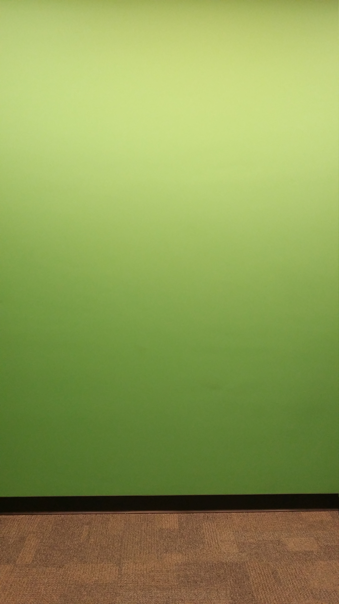
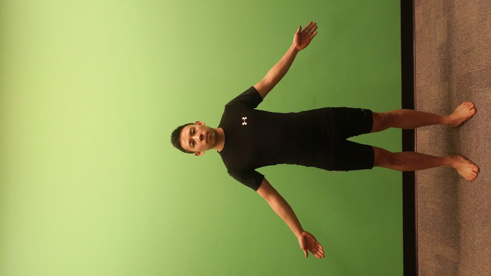
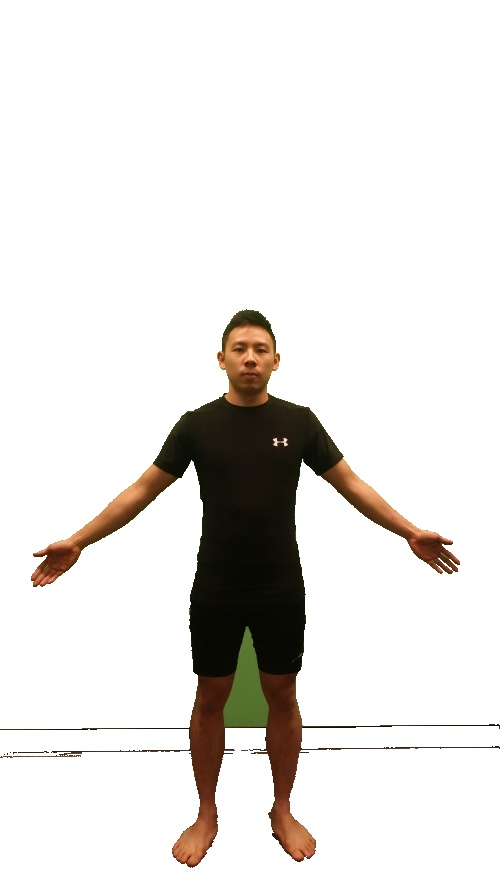
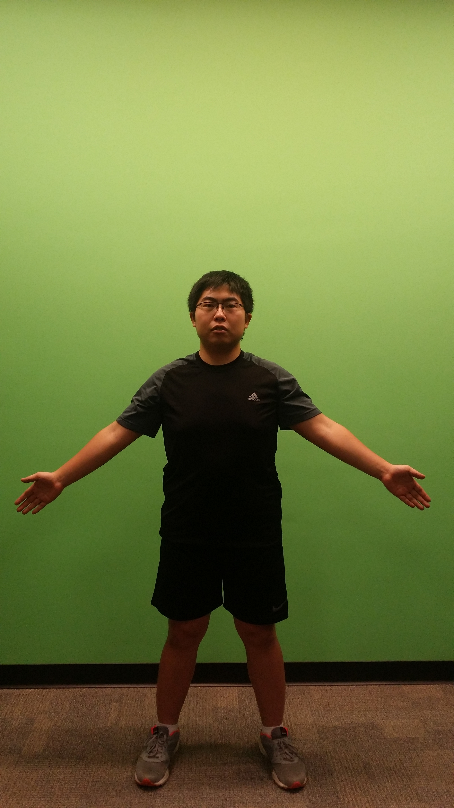
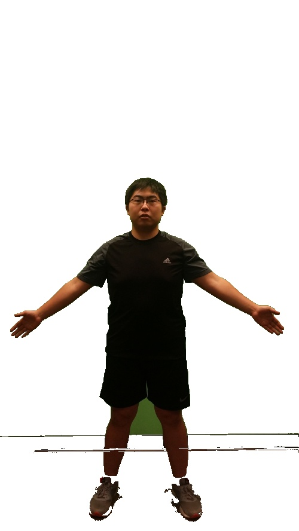

This script uses the [pymeanshift](https://github.com/fjean/pymeanshift) library which implements the mean shift algorithm described by the paper [Mean shift: a robust approach toward feature space analysis](http://ieeexplore.ieee.org/document/1000236/). 

**Requirements**

- One image of just the background without the human subject
- One image of the background with the human subject
- Both images should be taken on the same plane, ideally with a tripod for proper alignment

  

**Algorithm**

- Perform mean shift to obtain clusters in both the background and human image
- Clusters in segmented image have average hue of the original pixels that comprised the cluster
- Convert segmented image into LAB colour space
- Compare background and human pixels sequentially - if deltaE measurement exceeds 

**Results**

  

- Black bar outline still present: two pictures may not align exactly, shifted vertically by a pixel or two
- Green area in between legs recognized as a darker coloured cluster then the rest of the green background, hence why it isn't segmented

  

- Same issues as above
- Parts of the feet and shoes are over segmented: small white regions aren't being recognized as their own cluster. Minimizing the density parameter helps with this, but then we obtain too many clusters and cannot properly segment the rest of the image

**Tuning mean-shift parameters**

Spatial Radius: defines the "search circle" from a critical point. All pixels in that "search circle" are checked to see if they belong in the cluster (via range radius value)

- Need a value that is small enough to identify smaller features (e.g. hands), but big enough for bigger features (background)
- Increasing this value exponentially increases the runtime

Range Radius: the threshold value in pixel intensities. When taking the aboslute difference in the colour intensities of two pixels, if it is less than the threshold value, the pixels are in the same cluster.

- Need a value that is sensitive enough (lower) to differentiate between clusters that are similar clusters, but general enough (higher) to account for lighting and other parameters that could cause pixels of the same cluster to differ in intensity

Density: how many pixels comprise of a cluster. 

- Cannot be too small, else many irrelevant clusters are predicted
- Cannot be too big, or you might not be granular enough to capture smaller clusters

**Tuning segmentation parameters** 

Hue Threshold: acceptable difference in average colours between two clusters

- Small enough to differentiate between similar but different clusters, but large enough to picture-to-picture differences (e.g. caused by lighting, shadows)

Delta E Threshold: acceptable difference between LAB pixels to be considered the same

**Limitations**

- Clothing, skin tone and hair of human subject should be substantially different from the immediate background
- Parameters were manually found through trial and error. Automatically generating parameters is not addressed yet
- Algorithm doesn't perform well with detailed or small articles of clothing, i.e. socks or shoe patterns

**Example Usage**

`python meanshift.py background.jpg human.jpg 5 13 200 15`