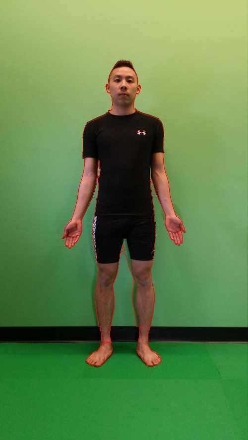

This script uses the [pymeanshift](https://github.com/fjean/pymeanshift) library which implements the mean shift algorithm described by the paper [Mean shift: a robust approach toward feature space analysis](http://ieeexplore.ieee.org/document/1000236/), in conjunction with thresholding to obtain a silhouette of a human given two images.

**Requirements**

- One image of just the background without the human subject
- One image of the background with the human subject
- Both images should be taken on the same plane, ideally with a tripod for proper alignment

  

**Algorithm**

- Perform mean shift to obtain clusters in both the background and human image
	- Clusters in segmented image have average hue of the original pixels that comprised the cluster
- Convert segmented and normal images into LAB colour space
- Perform two separate thresholding operations
	- Thresholding the two segmented images produced by mean shift
	- Thresholding the two original images 
- OR the two results together
- Generate a binary mask and overlay contours on original image

**Results**

     

- Shadowing causes segmentation to miss parts by the R leg
- Small area by the R armpit is missed -> clustering incorrectly joined the shirt with that small region

     

- Bits of the R thumb oversegmented, most likely due to shadowing
- Black bar not fully segmented -> specific body pose casted shadow that was too dark to segment properly

     

- Thresholding could not fully get area by right lef
- Shadowing made region too dark to segment

     

- Thresholding at region by legs caused oversegmentation -> Similarity in colour between darkened shadowed leg and the floor

     

- Shadowed region between legs differs too much to be handled by either method
- White colour socks and regions of shoe proved to be too similar to the background, causing oversegmentation
- Not all of the baseboard could se segmented, due to translation variance

**Analysis**

Basic Thresholding
- PROS: Very fast. In ideal scenarios where lighting is almost exact with minimal shadows, majority of segmentation can be achieved. 
- CONS: Suffers greatly from translation variance, requiring alignment of images. Suffers greatly from regions of similar colour between two images, causing oversegmentation (i.e. baseboard and legs)

Mean-shift Thresholding
- PROS: Less prone to oversegmentation due to knowledge of clusters and their spatial regions. Using the average colour of each cluster makes it slightly more robust to colour similarities. Can handle slightly more complicated backgrounds (i.e. patterened floor) due to its clustering nature.
- CONS: Much slower than a straight subtraction. Clusters can suffer from regions of shadowing where the average hue is much darker than it would be originally, since the cluster only looks at a small segment of the big picture. Requires fine tuning of parameters, which would be hard to do automatically

Thresholding + Mean-shift
- Using the two addresses issue of mean-shift thresholding finding smaller clusters that are hard to segment. Mean-shift has a tendency to undersegment, while thresholding has a tendency to oversegment. By fine tuning parameters so basic thresholding is done to a degree right before oversegmentation, and mean-shift thresholding is done to the best of its capabilities, and OR'ing the two results gives decent results.

**Tuning mean-shift parameters**

Spatial Radius: defines the "search circle" from a critical point. All pixels in that "search circle" are checked to see if they belong in the cluster (via range radius value)

- Need a value that is small enough to identify smaller features (e.g. hands), but big enough for bigger features (background)
- Increasing this value exponentially increases the runtime

Range Radius: the threshold value in pixel intensities. When taking the aboslute difference in the colour intensities of two pixels, if it is less than the threshold value, the pixels are in the same cluster.

- Need a value that is sensitive enough (lower) to differentiate between clusters that are similar clusters, but general enough (higher) to account for lighting and other parameters that could cause pixels of the same cluster to differ in intensity

Density: how many pixels comprise of a cluster. 

- Cannot be too small, else many irrelevant clusters are predicted
- Cannot be too big, or you might not be granular enough to capture smaller clusters

**Tuning segmentation parameters** 

clusterThresh: Delta E LAB tolerence for mean shift thresholding

labThresh: Delta E LAB tolerence for basic thresholding

**Limitations**

- Clothing, skin tone and hair of human subject should be substantially different from the immediate background
- Parameters were manually found through trial and error. Automatically generating parameters is not addressed yet
- Algorithm doesn't perform well with detailed or small articles of clothing, i.e. socks or shoe patterns

**Example Usage**

`python meanshift.py background.jpg human.jpg 5 13 200 15 15`